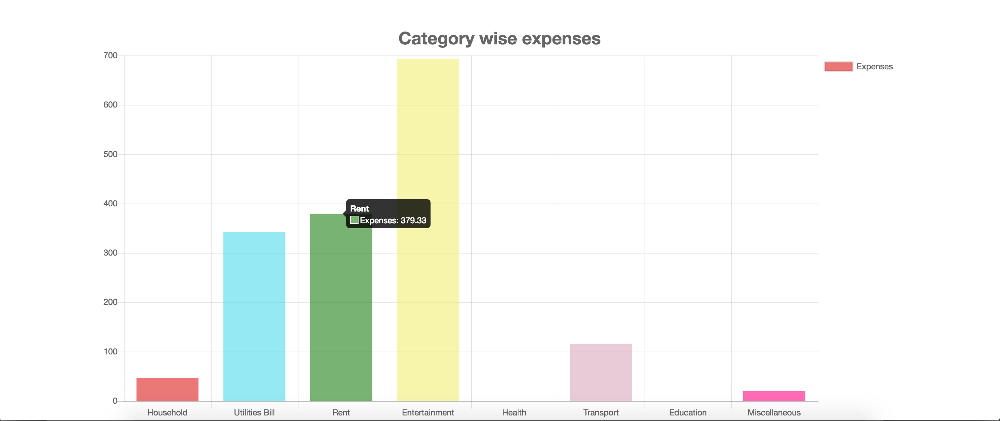
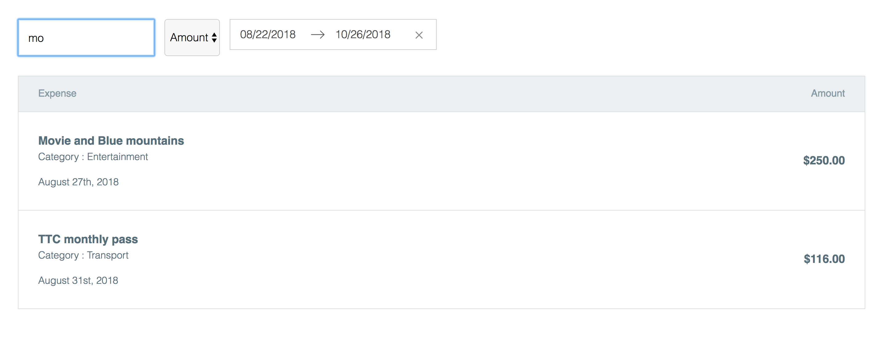

# Expensify-app

Home screen

Google Login

Dashboard

Charts : Category Wise visualization of Expenses

Calender Filter : Allows the user to filter expenses using dates

Amount and Search Filters : Allows the user to filter the expenses using Text based search or Sort By Amount

Add Expense Form : Allows the user to add a new expense

Edit Expense Form : Allows the user to edit the selected expense

Site Responsiveness : Site takes a slightly different layout in order to be responsive when mobile-breakpoint is reached

